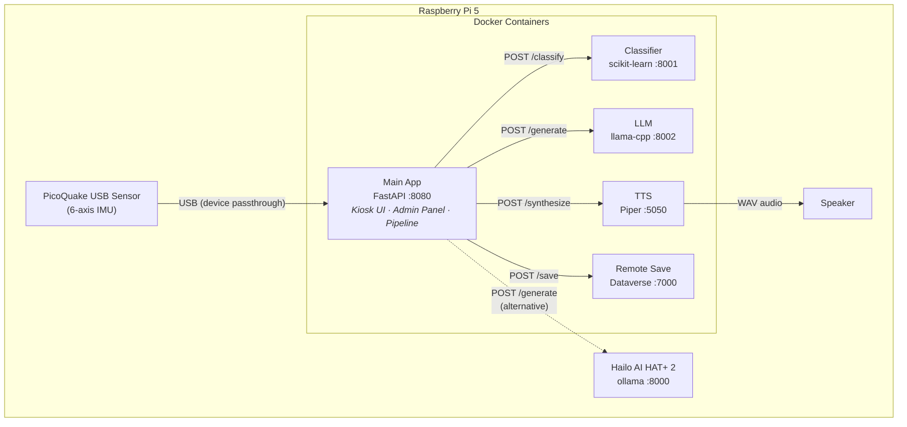

# rpiCoffee

A Raspberry Pi that detects your coffee and roasts you for it.

rpiCoffee is an IoT kiosk system that attaches a vibration sensor to a coffee machine, classifies the drink being brewed using machine learning, generates a witty one-liner about it with a fine-tuned LLM, and speaks it aloud — all running locally on a Raspberry Pi with no cloud dependency.

## How It Works

1. **Sense** — A PicoQuake USB IMU sensor captures 30 seconds of 6-axis vibration data (accelerometer + gyroscope) from the coffee machine
2. **Classify** — A scikit-learn RandomForest model identifies the coffee type (black, espresso, cappuccino) from 52 statistical features
3. **Comment** — A fine-tuned Qwen2.5-0.5B LLM (quantized to GGUF Q4_K_M, ~350 MB) generates a short, witty remark about the coffee and time of day
4. **Speak** — Piper TTS synthesizes the text as speech and plays it through a connected speaker
5. **Save** *(optional)* — Results and raw sensor data are persisted to Microsoft Dataverse

## Architecture



All services run as Docker containers, managed by Docker Compose. Backend services are gated by Docker Compose profiles so only enabled services start. The main app always starts.

For Raspberry Pi production with a real PicoQuake sensor, USB device passthrough is configured via `docker-compose.override.yml` (see the provided example). For local development, `SENSOR_MODE=mock` replays sample CSV files with no hardware needed.

An alternative LLM backend uses the **Hailo AI HAT+ 2** NPU accelerator via `hailo-ollama` for hardware-accelerated inference.

## Hardware

| Component | Purpose | Required? |
|-----------|---------|-----------|
| Raspberry Pi 5 (4–8 GB) | Main compute platform | Yes (Pi 4 also works) |
| PicoQuake USB sensor | 6-axis IMU vibration sensing | No — mock mode replays CSV samples |
| Hailo AI HAT+ 2 | NPU-accelerated LLM inference | No — llama-cpp CPU fallback |
| USB speaker (e.g. Jabra) | Play TTS audio | Recommended |
| Touchscreen display | Kiosk UI with virtual keyboard | Optional |

## Quick Start

All services run via Docker — no Python virtual environments or native installs required.

```bash
# 1. Clone the repository
git clone https://github.com/jenschristianschroder/rpiCoffee.git
cd rpiCoffee

# 2. Run the interactive installer
./setup.sh

# 3. Start all services
./start.sh

# 4. Open the kiosk UI
# http://<pi-ip>:8080
```

Or start directly with Docker Compose:

```bash
docker compose --profile classifier --profile llm --profile tts --profile remote-save up -d
```

### What `setup.sh` does

| Phase | Description |
|-------|-------------|
| 0 | Pre-flight checks (architecture, disk space, internet) |
| 1 | System dependencies (Docker, Python 3, build tools) |
| 2 | `.env` configuration + optional Dataverse credentials |
| 3 | Model downloads (LLM GGUF ~350 MB, TTS voice ~100 MB) |
| 4 | Docker image builds (app, classifier, LLM, TTS, remote-save) |
| 5 | Data directory bootstrap |

### Management scripts

| Script | Description |
|--------|-------------|
| `start.sh` | Start all Docker services (by profile), wait for health checks |
| `stop.sh` | Stop all Docker services |
| `status.sh` | Full status dashboard with health checks (supports `--json`) |

### Raspberry Pi USB sensor

To use the real PicoQuake USB sensor on a Pi, create a `docker-compose.override.yml` from the provided example:

```bash
cp docker-compose.override.yml.example docker-compose.override.yml
```

This passes the USB device into the app container and sets `SENSOR_MODE=picoquake`. You may also need udev rules for the PicoQuake — see the [PicoQuake setup](#picoquake-usb-setup) section.

## Local Development

No hardware required — the mock sensor replays sample CSV files. All you need is Docker.

```bash
# Start all services (app + backends)
docker compose --profile classifier --profile llm --profile tts --profile remote-save up -d

# Open the admin UI
# http://localhost:8080/admin/
```

To rebuild after code changes:

```bash
docker compose up -d --build
```

### Viewing Logs

```bash
# Follow all service logs
docker compose logs -f

# Follow a single service
docker compose logs -f app

# Last 100 lines of a container
docker logs --tail 100 rpicoffee-app

# Logs from the last 5 minutes
docker compose logs --since 5m
```

## Configuration

rpiCoffee uses a three-layer configuration system (highest priority last):

1. **Hardcoded defaults** (in `app/config.py`)
2. **`.env` file** values
3. **`data/settings.json`** — persisted at runtime via the admin panel

### Key Environment Variables

#### Services

| Variable | Default | Description |
|----------|---------|-------------|
| `CLASSIFIER_ENABLED` | `true` | Enable the ML classifier service |
| `CLASSIFIER_ENDPOINT` | `http://classifier:8001` | Classifier service URL |
| `LLM_ENABLED` | `true` | Enable the LLM text generation service |
| `LLM_BACKEND` | `llama-cpp` | `llama-cpp` for CPU or `ollama` for Hailo AI HAT+ |
| `LLM_ENDPOINT` | `http://llm:8002` | LLM service URL (llama-cpp) |
| `LLM_OLLAMA_ENDPOINT` | `http://localhost:8000` | Ollama endpoint (Hailo) |
| `TTS_ENABLED` | `true` | Enable text-to-speech |
| `TTS_ENDPOINT` | `http://tts:5050` | TTS service URL |
| `REMOTE_SAVE_ENABLED` | `true` | Enable Dataverse persistence |
| `REMOTE_SAVE_ENDPOINT` | `http://remote-save:7000` | Remote save service URL |

#### Sensor

| Variable | Default | Description |
|----------|---------|-------------|
| `SENSOR_MODE` | `mock` | `mock`, `picoquake`, or `serial` |
| `SENSOR_DEVICE_ID` | `cf79` | PicoQuake USB device ID (last 4 hex chars of serial) |
| `SENSOR_SAMPLE_RATE_HZ` | `100` | Sensor readings per second |
| `SENSOR_DURATION_S` | `30` | Seconds of data to capture per brew |
| `SENSOR_VIBRATION_THRESHOLD` | `0.15` | Accelerometer RMS threshold (g) for auto-trigger |
| `SENSOR_AUTO_TRIGGER` | `true` | Automatically start pipeline on vibration detection |
| `SENSOR_TRIGGER_SOURCES` | `accel` | Trigger source: `accel`, `gyro`, or `both` |
| `SENSOR_WARMUP_S` | `5` | Seconds to ignore triggers after sensor start |
| `SENSOR_COOLDOWN_S` | `10` | Seconds to wait between captures |

#### LLM Generation

| Variable | Default | Description |
|----------|---------|-------------|
| `LLM_MAX_TOKENS` | `256` | Maximum tokens per generation |
| `LLM_TEMPERATURE` | `0.7` | Sampling temperature (0.0–2.0) |
| `LLM_TOP_P` | `0.9` | Nucleus sampling threshold (0.0–1.0) |
| `LLM_SYSTEM_MESSAGE` | *(coffee commentator prompt)* | System prompt controlling tone/style |
| `LLM_KEEP_ALIVE` | `-1` | Ollama keep_alive: -1=forever, 0=unload, or seconds |

#### Auth & UI

| Variable | Default | Description |
|----------|---------|-------------|
| `SECRET_KEY` | `change-me-to-a-random-string` | Session signing key |
| `ADMIN_PASSWORD` | `1234` | Initial admin password (hashed on first run) |
| `VIRTUAL_KEYBOARD_ENABLED` | `false` | On-screen keyboard for touchscreen kiosk |

## Admin Panel

The web-based admin panel at `/admin` provides:

- **Service configuration** — enable/disable services, change endpoints, LLM parameters
- **Sensor settings** — mode, thresholds, trigger sources, warmup/cooldown
- **Training data management** — view, delete, and promote training CSV files
- **Model management** — trigger training, upload models, view model info
- **System message editor** — customize the LLM personality
- **Password management** — change the admin PIN

Access is protected by a PIN (default: `1234`). Sessions expire after 10 minutes of inactivity.

## Services

| Service | Port | Description | README |
|---------|------|-------------|--------|
| **Main App** | 8080 | FastAPI orchestrator, kiosk UI, admin panel, sensor management | [app/README.md](app/README.md) |
| **Classifier** | 8001 | scikit-learn RandomForest coffee type classifier | [services/classifier/README.md](services/classifier/README.md) |
| **LLM** | 8002 | Fine-tuned Qwen2.5-0.5B GGUF inference server | [services/llm/README.md](services/llm/README.md) |
| **TTS** | 5050 | Piper TTS offline speech synthesis | [services/tts/README.md](services/tts/README.md) |
| **Remote Save** | 7000 | Microsoft Dataverse persistence service | [services/remote-save/README.md](services/remote-save/README.md) |

## Project Structure

```
rpiCoffee/
├── app/                        # Main FastAPI application (Docker)
│   ├── main.py                 # App entry point, API routes, auto-trigger loop
│   ├── pipeline.py             # 5-stage brew pipeline orchestrator
│   ├── config.py               # Layered configuration manager
│   ├── Dockerfile              # App container image
│   ├── admin/                  # Admin panel (routes + Jinja2 templates)
│   ├── sensor/                 # Sensor abstraction (mock, picoquake, serial)
│   └── services/               # HTTP clients for backend services
├── services/
│   ├── classifier/             # ML coffee classifier (Docker)
│   ├── llm/                    # Fine-tuned LLM server (Docker)
│   ├── tts/                    # Piper TTS server (Docker)
│   └── remote-save/            # Dataverse upload service (Docker)
├── data/                       # Sample CSVs, settings, training data, audio
├── docker-compose.yml          # All service definitions (app + profile-gated backends)
├── docker-compose.override.yml.example  # Pi production overrides (USB sensor)
├── setup.sh                    # Interactive setup (env config + Docker builds)
├── start.sh / stop.sh          # Docker Compose lifecycle management
└── status.sh                   # Health check dashboard
```

## PicoQuake USB Setup

On a Raspberry Pi with a real PicoQuake sensor, create udev rules so the device is accessible from Docker:

```bash
# udev rule for PicoQuake (world-readable + symlink)
echo 'SUBSYSTEM=="tty", ATTRS{idProduct}=="000a", ATTRS{idVendor}=="2e8a", MODE="0666", SYMLINK+="picoquake"' \
  | sudo tee /etc/udev/rules.d/99-picoquake.rules

# Disable USB autosuspend to prevent connection drops
echo 'ACTION=="add", SUBSYSTEM=="usb", ATTRS{idProduct}=="000a", ATTRS{idVendor}=="2e8a", TEST=="power/control", ATTR{power/control}="on"' \
  | sudo tee /etc/udev/rules.d/99-picoquake-power.rules

sudo udevadm control --reload-rules && sudo udevadm trigger
```

Then copy the override file and start:

```bash
cp docker-compose.override.yml.example docker-compose.override.yml
./start.sh
```

## License

This project is provided as-is for educational and personal use.
