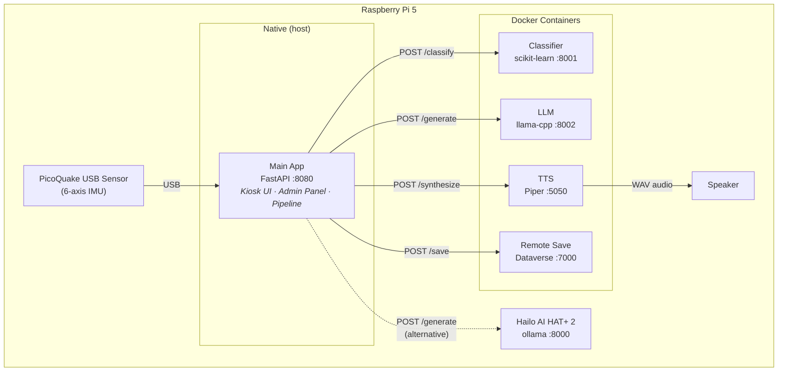

# rpiCoffee

A Raspberry Pi that detects your coffee and roasts you for it.

rpiCoffee is an IoT kiosk system that attaches a vibration sensor to a coffee machine, classifies the drink being brewed using machine learning, generates a witty one-liner about it with a fine-tuned LLM, and speaks it aloud — all running locally on a Raspberry Pi with no cloud dependency.

## How It Works

1. **Sense** — A PicoQuake USB IMU sensor captures 30 seconds of 6-axis vibration data (accelerometer + gyroscope) from the coffee machine
2. **Classify** — A scikit-learn RandomForest model identifies the coffee type (black, espresso, cappuccino) from 52 statistical features
3. **Comment** — A fine-tuned Qwen2.5-0.5B LLM (quantized to GGUF Q4_K_M, ~350 MB) generates a short, witty remark about the coffee and time of day
4. **Speak** — Piper TTS synthesizes the text as speech and plays it through a connected speaker
5. **Save** *(optional)* — Results and raw sensor data are persisted to Microsoft Dataverse

## Architecture



The main app runs **natively** on the host (not in Docker) for direct USB sensor access. Backend services run as Docker containers, each gated by a Docker Compose profile so only enabled services start.

An alternative LLM backend uses the **Hailo AI HAT+ 2** NPU accelerator via `hailo-ollama` for hardware-accelerated inference.

## Hardware

| Component | Purpose | Required? |
|-----------|---------|-----------|
| Raspberry Pi 5 (4–8 GB) | Main compute platform | Yes (Pi 4 also works) |
| PicoQuake USB sensor | 6-axis IMU vibration sensing | No — mock mode replays CSV samples |
| Hailo AI HAT+ 2 | NPU-accelerated LLM inference | No — llama-cpp CPU fallback |
| USB speaker (e.g. Jabra) | Play TTS audio | Recommended |
| Touchscreen display | Kiosk UI with virtual keyboard | Optional |

## Get Started

| Guide | Description |
|-------|-------------|
| **[Setup on Raspberry Pi](docs/setup-raspberry-pi.md)** | Full installation, configuration, management scripts, systemd auto-start, and troubleshooting |
| **[Local Development](docs/local-development.md)** | Development environment setup, mock sensor, testing, architecture patterns, and contribution guidelines |

## Services

| Service | Port | Description | README |
|---------|------|-------------|--------|
| **Main App** | 8080 | FastAPI orchestrator, kiosk UI, admin panel, sensor management | [app/README.md](app/README.md) |
| **Classifier** | 8001 | scikit-learn RandomForest coffee type classifier | [services/classifier/README.md](services/classifier/README.md) |
| **LLM** | 8002 | Fine-tuned Qwen2.5-0.5B GGUF inference server | [services/llm/README.md](services/llm/README.md) |
| **TTS** | 5050 | Piper TTS offline speech synthesis | [services/tts/README.md](services/tts/README.md) |
| **Remote Save** | 7000 | Microsoft Dataverse persistence service | [services/remote-save/README.md](services/remote-save/README.md) |

## Project Structure

```
rpiCoffee/
├── app/                        # Main FastAPI application (runs natively)
│   ├── main.py                 # App entry point, API routes, auto-trigger loop
│   ├── pipeline.py             # 5-stage brew pipeline orchestrator
│   ├── config.py               # Layered configuration manager
│   ├── admin/                  # Admin panel (routes + Jinja2 templates)
│   ├── sensor/                 # Sensor abstraction (mock, picoquake, serial)
│   └── services/               # HTTP clients for backend services
├── docs/                       # Documentation
│   ├── setup-raspberry-pi.md   # Raspberry Pi installation & operations guide
│   └── local-development.md    # Local development & contribution guide
├── services/
│   ├── classifier/             # ML coffee classifier (Docker)
│   ├── llm/                    # Fine-tuned LLM server (Docker)
│   ├── tts/                    # Piper TTS server (Docker)
│   └── remote-save/            # Dataverse upload service (Docker)
├── data/                       # Sample CSVs, settings, training data, audio
├── docker-compose.yml          # Backend service definitions (profile-gated)
├── setup.sh                    # Interactive Raspberry Pi installer
├── start.sh / stop.sh          # Service lifecycle management
├── status.sh                   # Health check dashboard
└── run-app-local.bat           # Windows: app on host + Docker backends
```

## License

This project is provided as-is for educational and personal use.
