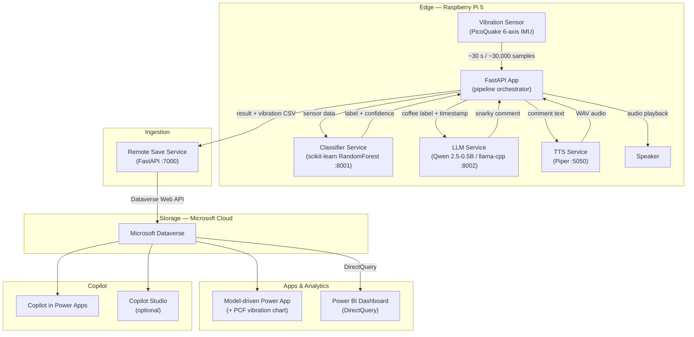
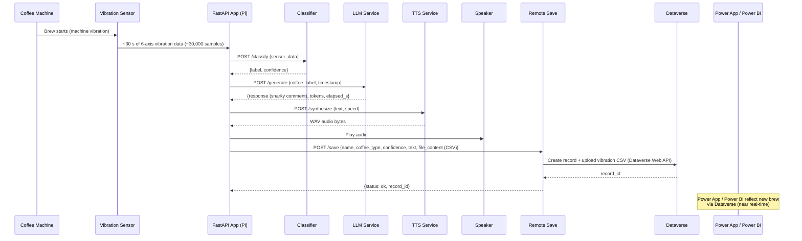

# IoT Coffee — Architecture & Data Flow

> **Microsoft Innovation Hub Copenhagen — Internal Demo Solution**

---

## Executive Summary for Demos

IoT Coffee is a demo solution that turns every coffee brew into a live data event.
An industrial vibration sensor (6-axis IMU) is mounted on a coffee machine and connected to a Raspberry Pi 5.
When someone starts a brew, the Pi captures approximately 30 seconds of vibration data (~30,000 data points at 100 Hz) and runs a **scikit-learn RandomForest** classifier locally to determine the coffee type — black, espresso, or cappuccino.
A fine-tuned **Qwen 2.5-0.5B** large language model, also running on the Pi, generates a witty, snarky comment about the brew in real time.
That comment is turned into spoken audio by **Piper TTS** and played through a connected speaker — all without any cloud dependency.
The full result — classification, confidence score, vibration series, and the snarky comment — is then sent to a cloud endpoint that persists it into **Microsoft Dataverse**.
A **model-driven Power App** lets users browse historical brews and visualize the vibration pattern of each brew through a custom PCF control.
A **Power BI** dashboard with **DirectQuery** to Dataverse provides near real-time analytics across all brews.
Finally, **Copilot** experiences are demonstrated inside the model-driven app and optionally via **Copilot Studio**, showing how natural language can be used to query brew data.
The solution showcases how edge ML, generative AI, and the Microsoft Power Platform can work together end-to-end in a tangible, demo-friendly scenario.

---

## Layered Architecture Diagram

---

## Brew Event Sequence Diagram

---

## Component Table

| # | Component | Runs on | What It Does | Data Consumed | Data Produced |
|---|-----------|---------|--------------|---------------|---------------|
| 1 | **PicoQuake USB IMU** | Edge (Pi) | Captures 6-axis vibration (accelerometer + gyroscope) at 100 Hz | Physical machine vibration | Raw sensor samples (acc_x/y/z, gyro_x/y/z, elapsed_s) |
| 2 | **FastAPI App** (pipeline orchestrator) | Edge (Pi) | Orchestrates the full brew pipeline; serves admin UI; auto-trigger loop detects brew start via RMS threshold | Sensor data, service responses | Pipeline result dict; SSE events to browser |
| 3 | **Classifier Service** (scikit-learn) | Edge (Pi, Docker :8001) | RandomForest classification of vibration data into coffee type | 6-axis sensor array | `label` (black / espresso / cappuccino), `confidence` (0–1) |
| 4 | **LLM Service** (llama-cpp / Qwen 2.5-0.5B) | Edge (Pi, Docker :8002) | Generates a witty one-liner about the brew | `coffee_label`, ISO-8601 `timestamp` | `response` (text), `tokens`, `elapsed_s`, `tokens_per_s` |
| 5 | **LLM-Ollama Service** *(optional)* | Edge (Pi, Docker :8003) | Ollama proxy for Hailo AI HAT+ NPU acceleration | Same as LLM | Same as LLM |
| 6 | **TTS Service** (Piper) | Edge (Pi, Docker :5050) | Offline text-to-speech synthesis | Comment text, speed | WAV audio bytes |
| 7 | **Speaker** | Edge (Pi) | Plays the synthesized audio | WAV audio | Audible speech |
| 8 | **Remote Save Service** | Edge or Cloud (Docker :7000) | Converts result to Dataverse record; uploads vibration CSV as file column | Pipeline result + base64-encoded CSV | Dataverse record ID |
| 9 | **Microsoft Dataverse** | Cloud (Microsoft 365) | Stores brew records, vibration files, snarky comments | Records via Dataverse Web API | Queryable table rows + file attachments |
| 10 | **Model-driven Power App** | Cloud (Power Platform) | Browse brews; custom PCF control visualizes vibration pattern | Dataverse rows | Interactive UI for demo audience |
| 11 | **Power BI Dashboard** | Cloud (Power BI Service) | Near real-time analytics on brew data | Dataverse via DirectQuery | Charts, KPIs, trend reports |
| 12 | **Copilot (in Power Apps)** | Cloud (Power Platform) | Natural-language queries over brew data | Dataverse rows | Conversational answers |
| 13 | **Copilot Studio** *(optional)* | Cloud (Power Platform) | Custom copilot agent for extended Q&A and actions | Dataverse / custom connectors | Conversational answers and actions |

---

## Data Flow Payload (Conceptual)

The payload sent from the Pi to the Remote Save Service (and ultimately to Dataverse) contains:

| Field | Type | Description |
|-------|------|-------------|
| `name` | string | Record name, e.g. `cappuccino-20260314-091500` |
| `coffee_type` | string | Classified coffee type: `black`, `espresso`, or `cappuccino` |
| `confidence` | float | Classification confidence score (0.0–1.0) |
| `text` | string | LLM-generated snarky comment |
| `data` | string | Full vibration series as CSV text (with header row) |
| `file_content` | string | Base64-encoded vibration CSV (uploaded to Dataverse file column) |
| `file_name` | string | Filename for the CSV attachment, e.g. `cappuccino-20260314-091500.csv` |

### Vibration CSV structure

Each row in the vibration CSV contains:

| Column | Unit | Description |
|--------|------|-------------|
| `label` | — | Coffee type label (set post-classification) |
| `elapsed_s` | seconds | Time offset from recording start |
| `acc_x` | g | Accelerometer X-axis |
| `acc_y` | g | Accelerometer Y-axis |
| `acc_z` | g | Accelerometer Z-axis |
| `gyro_x` | °/s | Gyroscope X-axis |
| `gyro_y` | °/s | Gyroscope Y-axis |
| `gyro_z` | °/s | Gyroscope Z-axis |

### Dataverse record mapping

The Remote Save Service maps `coffee_type` to a Dataverse option-set integer:

| Coffee Type | Option-Set Value |
|-------------|------------------|
| black | 737200000 |
| espresso | 737200001 |
| cappuccino | 737200002 |

---

## Observability & Troubleshooting

| Hop | What to Check | How |
|-----|---------------|-----|
| **Sensor → App** | Sensor connected and streaming; RMS threshold triggering correctly; sample count ≈ 30,000 | Admin UI live chart; app logs (`rpicoffee.sensor.*`); check `SENSOR_MODE`, `SENSOR_VIBRATION_THRESHOLD` |
| **App → Classifier** | Classifier container healthy; model loaded; response within timeout | `GET /health` on `:8001`; app logs (`rpicoffee.classifier_client`); check `CLASSIFIER_ENABLED` |
| **App → LLM** | LLM container healthy; model loaded; generation completing within `LLM_TIMEOUT` | `GET /health` on `:8002`; app logs (`rpicoffee.llm_client`); check `LLM_ENABLED`, `LLM_BACKEND` |
| **App → TTS** | TTS container healthy; audio bytes returned | `GET /health` on `:5050`; app logs (`rpicoffee.tts_client`); check `TTS_ENABLED` |
| **TTS → Speaker** | Audio device present; volume set | `aplay -l` on Pi; check ALSA config |
| **App → Remote Save** | Remote Save container healthy; correct Dataverse credentials configured | `GET /health` on `:7000`; app logs (`rpicoffee.remote_save`); check `REMOTE_SAVE_ENABLED` |
| **Remote Save → Dataverse** | Azure AD token obtained; Dataverse environment reachable; table & column names correct | Remote Save service logs; verify `DATAVERSE_ENV_URL`, `DATAVERSE_TABLE`, `DATAVERSE_COLUMN` via service `/settings` endpoint |
| **Dataverse → Power App** | Records appearing in table; PCF control rendering | Open the model-driven app; check Dataverse table in make.powerapps.com |
| **Dataverse → Power BI** | DirectQuery connection active; data refreshing | Open Power BI report; check dataset connection settings; look for refresh errors |
| **Copilot** | Copilot enabled in the environment; Dataverse tables accessible | Test a natural-language query in the app; check Copilot Studio agent logs if using a custom agent |

> **Tip:** Each containerized service exposes a `GET /health` endpoint. The admin panel on the Pi aggregates all health checks into a single dashboard view.

---

## Demo Talking Points

| Topic | Talking Point |
|-------|---------------|
| **IoT / Edge ML** | "The Raspberry Pi acts as a full edge compute node — it senses, classifies, generates commentary, and speaks, all locally with zero cloud latency. The entire brew pipeline runs in about 30 seconds." |
| **ML Classification** | "A scikit-learn RandomForest model was trained on labelled vibration recordings. It classifies ~30,000 data points into one of three coffee types with high confidence — and the model can be retrained on-device." |
| **LLM + TTS** | "A fine-tuned Qwen 2.5-0.5B model generates a witty one-liner for each brew. Piper TTS converts it to speech — no internet required. The optional Hailo AI HAT+ provides NPU-accelerated inference." |
| **Power Platform** | "The brew result lands in Dataverse within seconds. From there, Power Platform takes over — model-driven app for detailed browsing, Power BI for analytics, and Copilot for natural-language interaction." |
| **Dataverse** | "Microsoft Dataverse is the single source of truth. Each brew becomes a record with metadata (coffee type, confidence, snarky comment) and a file attachment containing the full vibration series." |
| **Model-driven App** | "A model-driven Power App provides a no-code browsable interface over all brews. A custom PCF control renders the vibration waveform inline so you can visually compare brew patterns." |
| **Power BI DirectQuery** | "The Power BI dashboard uses DirectQuery to Dataverse — no scheduled refresh, no data duplication. When a new brew lands, it's immediately queryable in the report." |
| **Copilot / Copilot Studio** | "Copilot in Power Apps lets you ask questions like 'How many espressos were brewed today?' in natural language. Copilot Studio extends this with custom agents that can take actions beyond Q&A." |

---

## Assumptions & Constraints

| # | Item | Note |
|---|------|------|
| 1 | **Three coffee types** | The classifier is trained on `black`, `espresso`, and `cappuccino`. Additional types require new training data and retraining. |
| 2 | **Local-only edge inference** | All ML, LLM, and TTS inference runs on the Pi. No cloud AI services are used at the edge. |
| 3 | **Network for cloud sync only** | The Pi requires network connectivity only for the Remote Save → Dataverse step. All other pipeline stages work offline. |
| 4 | **Dataverse environment** | A Microsoft 365 / Power Platform environment with Dataverse must be provisioned separately. Table schema and PCF control are configured outside this repo. *(TBD — exact table schema and PCF component are not defined in the repository.)* |
| 5 | **Power App & Power BI** | The model-driven Power App and Power BI dashboard are authored in the Power Platform and are not source-controlled in this repository. *(TBD — solution export not included.)* |
| 6 | **Copilot availability** | Copilot features require a Power Platform environment with Copilot enabled and appropriate licensing. *(TBD — specific Copilot Studio agent definition not included in repo.)* |
| 7 | **Sensor hardware** | The PicoQuake USB IMU is required for production use. A mock sensor mode replays sample CSV files for demos without hardware. |
| 8 | **Docker on Pi** | Backend services (classifier, LLM, TTS, remote-save) run as Docker containers on the Pi, managed via Docker Compose with profile-gated startup. |
| 9 | **Audio output** | A USB or 3.5 mm speaker must be connected to the Pi for TTS playback. |
| 10 | **Hailo AI HAT+** *(optional)* | NPU-accelerated LLM inference via Ollama is supported but not required. Falls back to CPU-based llama-cpp. |
